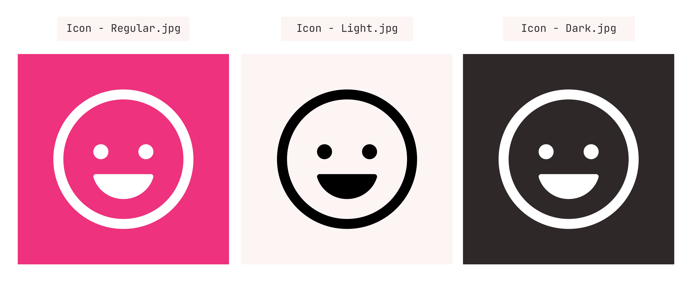
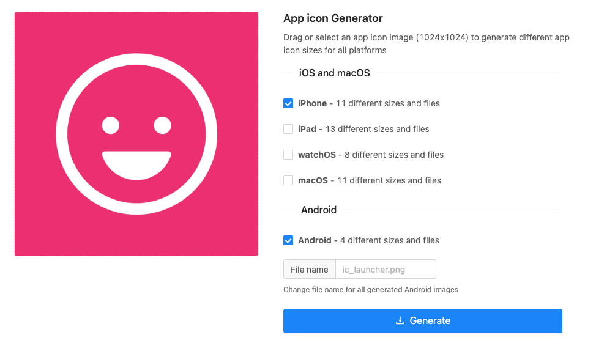
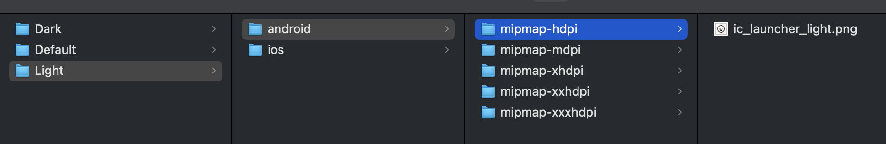
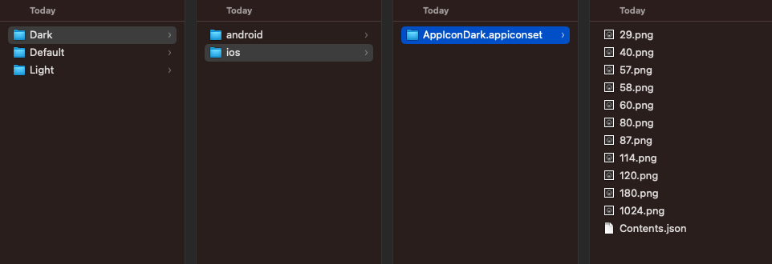
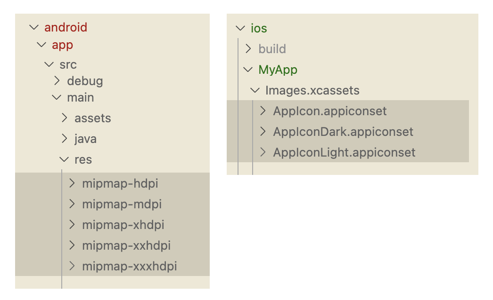

<p align="center">
  <h2 align="center">React Native Change Icon</h2>
  <h4 align="center">Programmatically change the application icon.</h4>
</p>

<p align="center">
	<a href="https://www.npmjs.com/package/react-native-change-icon"></a>
	<a href="https://www.npmjs.com/package/react-native-change-icon"></a>
	<a href="https://www.npmjs.com/package/react-native-change-icon"></a>
	<a href="https://www.npmjs.com/package/react-native-change-icon"></a>
</p>

---

<p align="center">
	<p align="center">Supported Platforms</p>
	<p align="center">
		
		
	</p>
	<div align="center">
		<code>yarn add react-native-change-icon</code>
		<br/>
		<code>npm i react-native-change-icon</code>
	</div>
</p>

---

<p align="center">
	<h2 align="center">How to Use</h2>
</p>

---

<p align="center">
	<h3 align="center"><strong>1.</strong>
		Make your Icons
	</h3>
	<p align="center">
		I'd suggest exporting them around `1024px` or higher.
	</p>
</p>
  

<div align="center">
	<a href="./docs/examples/Step-1">Example Icon Files</a>
	
</div>

---

<p align="center">
	<h3 align="center"><strong>2.</strong>
		Generate Icons
	</h3>
	<p align="center">
		Use a service such as <a href="https://www.appicon.co/">https://www.appicon.co/</a> in order to generate the platform specific icon files.
	</p>
</p>

- Just upload your images from earlier, and checkmark both `iPhone` and `Android`.
- This will give you a `.zip` file with the files needed.

<div align="center">
	
</div>

---

<p align="center">
	<h3 align="center"><strong>3.</strong>
		Prepare Icon Files
	</h3>
</p>

- You need to rename and sort these files slightly differently for both `iOS` and `Android` - I'd recommend keeping the default icon as the default name as this will make things easier for you.

**Android 🤖**
1. Simply just rename them to something appropriate - typically this follows the naming convention `ic_launcher_<type>.png` e.g. `ic_launcher_dark.png`
   - Make sure to keep them within the folder structure they are in `mpmap-hdpi`... etc.

<div align="center">
	<a href="./docs/examples/Step-3">Example Android Icon Sets</a>
	
</div>

**iOS 🍏**
1. You will need the folder called `AppIcon.appiconset` as this contains your icons.
2. Rename this folder a bit like above for android using a naming convention such as `AppIcon<type>.appiconset` e.g. `AppIconDark.appiconset`
3. You will also need to edit the `Contents.json` to change and references from `AppIcon` to what you have renamed the file now e.g. `AppIconDark`

<div align="center">
	<a href="./docs/examples/Step-3">Example iOS Icon Sets</a>
	
</div>

---

<p align="center">
	<h3 align="center"><strong>4.</strong>
		Import the Icons
	</h3>
</p>

**Android 🤖**
1. Drag all of the `mipmap` folders into `android/app/src/main/res/`

**iOS 🍏**
1. Drag all of the `.appiconset` folders into `ios/<app-name>/Images.xcassets`

<div align="center">
	
</div>

---

<p align="center">
	<h3 align="center"><strong>5.</strong>
		Setup Environments
	</h3>
</p>

**Android 🤖**
1. Add an alias for each of your new icons within the `AndroidManifest.xml` (within `<application>`).
   - Make sure these have the properties as shown below.
   - For the name prefix it `MainActivity...` followed by the name you will use to reference your icon. e.g. for our light icon we will use `com.myCompany.myApp.MainActivityLight` (replace `com.myCompany.myApp` with your package name)


<div align="center">
	<a href="./docs/examples/Step-4/AndroidManifest.xml">Example AndroidManifest.xml</a>
</div>

```xml
<activity-alias 
	android:name="com.myCompany.myApp.MainActivityLight"
	android:enabled="false"
	android:exported="true"
	android:icon="@mipmap/ic_launcher_light"
	android:targetActivity=".MainActivity">
	<intent-filter>
		<action android:name="android.intent.action.MAIN" />
		<category android:name="android.intent.category.LAUNCHER" />
	</intent-filter>
	</activity-alias>
```

**iOS 🍏**
1. At the bottom of your `Info.plist` insert a key for `CFBundleIcons`
2. Within this dictionary add another key for `CFBundleAlternateIcons`
3. Finally then within this dictionary you can add in the keys for you new icons
   - The `key` is the name you will reference from within code.
   - Set the first array item to the name of the `.appiconset` we created earlier. 

<div align="center">
	<a href="./docs/examples/Step-4/Info.plist">Example Info.plist</a>
</div>

```xml
<key>Dark</key>
<dict>
	<key>CFBundleIconFiles</key>
	<array>
		<string>AppIconDark</string>
	</array>
	<key>UIPrerenderedIcon</key>
	<false/>
</dict>
```

---

<p align="center">
	<h3 align="center"><strong>6.</strong>
		Use the Icons
	</h3>
	<p align="center">
		You can now use your icons and switch between them within react native 🎉
	</p>
</p>


```javascript
import { setIcon, getIcon, resetIcon } from 'react-native-change-icon';

// Pass the name of icon to be enabled
setIcon('Dark');
setIcon('Light');

// Get the icon currently enabled
getIcon();

// Reset the Icon to the default
resetIcon();
```

> All functions are typed and return a promise that either resolves successfully, or will reject with the error that has occurred.