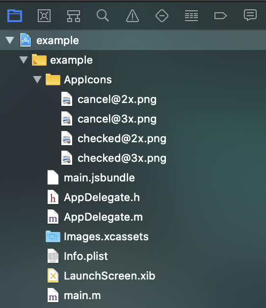
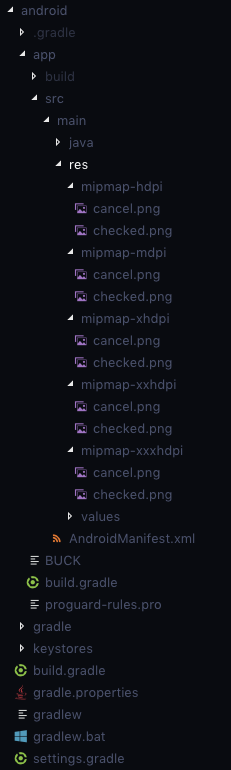

# React Native Change Icon

Change Application Icon Programmatically.
- [x] iOS
- [x] Android

## Getting started

`$ yarn add install react-native-change-icon`

### Mostly automatic installation (Recommended)

`$ react-native link react-native-change-icon`

### Manual installation

#### iOS

1. In XCode, in the project navigator, right click `Libraries` ➜ `Add Files to [your project's name]`
2. Go to `node_modules` ➜ `react-native-change-icon` and add `RNChangeIcon.xcodeproj`
3. In XCode, in the project navigator, select your project. Add `libRNChangeIcon.a` to your project's `Build Phases` ➜ `Link Binary With Libraries`
4. Run your project (`Cmd+R`)<

#### Android

1. Open up `android/app/src/main/java/[...]/MainApplication.java`
  - Add `import com.reactlibrary.RNChangeIconPackage;` to the imports at the top of the file
  - Add `new RNChangeIconPackage()` to the list returned by the `getPackages()` method
2. Append the following lines to `android/settings.gradle`:
  	```
  	include ':react-native-change-icon'
  	project(':react-native-change-icon').projectDir = new File(rootProject.projectDir, 	'../node_modules/react-native-change-icon/android')
  	```
3. Insert the following lines inside the dependencies block in `android/app/build.gradle`:
  	```
      compile project(':react-native-change-icon')
  	```

## Usage

#### iOS

1. Open your project in Xcode and create an **App Icons** group inside you app's group.
2. Add all the app icons you need inside this group with names like *icon@2x.png*, *icon@3x.png*.
3. Your directory structure in Xcode would look like:



4. Open the **Info.plist** file.
5. Add `Icon files (iOS 5)` to the **Information Property List**.
6. Add `CFBundleAlternateIcons` as a dictionary to the `Icon files (iOS 5)`, it is used for alternative icons.
7. Add dictionaries under `CFBundleAlternateIcons` named as your icon names in **App Icons** group.
8. For each dictionary, two properties, `UIPrerenderedIcon` and `CFBundleIconFiles` need to be configured.
9. Set the type of `UIPrerenderedIcon` to `String` and its value to `NO`.
10. Set the type of `CFBundleIconFiles` to `Array` and set its first key, `Item 0`'s type to `String` and its value to the corresponding icon names.
11. After all these steps, your **Info.plist** file should look like:


#### Android

1. Add all the icons you need inside your project's `android/app/src/main/res/mipmap-*` directories:



2. Modify your `AndroidManifest.xml` file's `<application>` tag as following:
```xml
<application
	android:name=".MainApplication"
	android:label="@string/app_name"
	android:icon="@mipmap/checked"
	android:allowBackup="false"
	android:theme="@style/AppTheme">
	<activity android:name=".MainActivity" />
	<activity-alias
		android:name="com.example.MainActivitychecked"
		android:enabled="true"
		android:icon="@mipmap/checked"
		android:targetActivity=".MainActivity">
		<intent-filter>
			<action android:name="android.intent.action.MAIN" />
			<category android:name="android.intent.category.LAUNCHER" />
		</intent-filter>
	</activity-alias>
	<activity-alias
		android:name="com.example.MainActivitycancel"
		android:enabled="false"
		android:icon="@mipmap/cancel"
		android:targetActivity=".MainActivity">
		<intent-filter>
			<action android:name="android.intent.action.MAIN" />
			<category android:name="android.intent.category.LAUNCHER" />
		</intent-filter>
	</activity-alias>
	<activity android:name="com.facebook.react.devsupport.DevSettingsActivity" />
</application>
```
You can create more `<activity-alias>` tags to make more alternate icons.
*Note that the name in <activity-alias> should be "com.packageName.MainActivity%", where `%` is the icon name.*

3. Open the `MainApplication.java` file.
4. Pass `BuildConfig.APPLICATION_ID` to `new RNChangeIconPackage()` inside the `getPackages()` function.
```java
@Override
protected List<ReactPackage> getPackages() {
	return Arrays.<ReactPackage>asList(
		new MainReactPackage(),
		new RNChangeIconPackage(BuildConfig.APPLICATION_ID)
	);
}
```

**Note that all the icon names must be in lowercase and only limited to alphabets `a-z`**

Now you can use the following code to change application icon:

```javascript
import { changeIcon } from 'react-native-change-icon';

// Pass the name of icon to be enabled
changeIcon('icon_name');
```

**Please refer to the Example app for demo on implementation**
